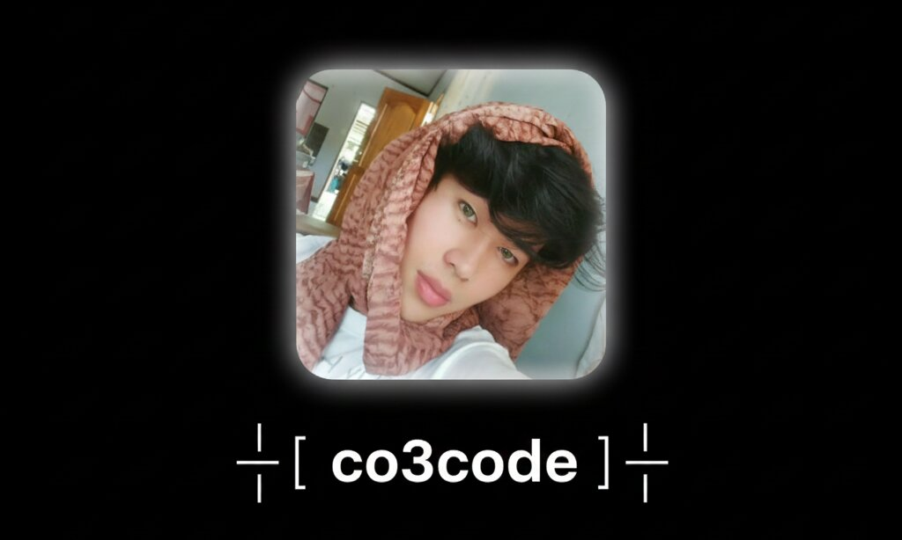

<!-- Animated Text Overlay on Clickable Banner -->

  <a href="https://github.com/Co3code">
    
    <!-- Animated Text Overlay -->
    
  </a>

---

I’m a **self-taught developer** on a continuous journey to become a **Full Stack Web Developer**.  
Right now, I’m focusing on **PHP**, **MySQL**, and **modern web technologies** — building small projects, learning by doing, and pushing everything I create here on GitHub.  

Every repo you see is a piece of my learning path — mistakes, progress, and growth included. 🚀  

---

### 🧩 What I’m Working On
- Building hands-on projects to strengthen my **backend & frontend** skills  
- Learning how to structure cleaner, more efficient code  
- Exploring **databases**, **APIs**, and **web app design**  
- Sharing my progress to inspire other beginners who are learning too  

---

### 🛠️ Tech Stack

  

---

### 📊 GitHub Stats

  
  

  

---

### 📫 Connect with Me

  
  

---

⭐️ *I’m learning every day — one commit at a time.*  
🧠 *Follow my journey as I grow from beginner to full stack developer.*
