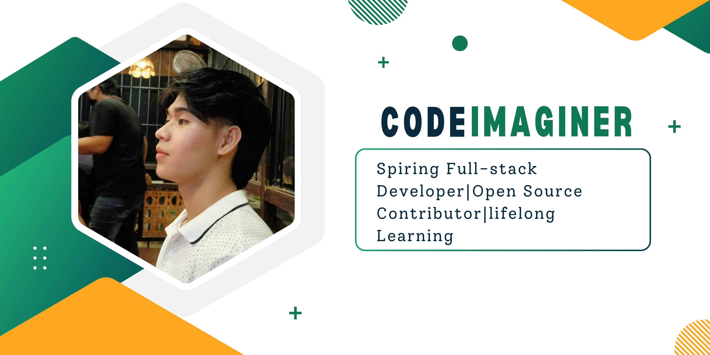

<!-- Banner -->

  

---

### 👨‍💻 About Me
- 🌱 I’m currently sharpening my skills in **PHP, MySQL, and Full Stack Web Development**
- 💬 Ask me about **Web Development, Databases, and Open Source Projects**
- 📫 Reach me at: **countian3@gmail.com**
- ⚡ Fun fact: *I turn ☕ coffee into clean code*

### 🚀 Languages & Tools

  

---

### 📊 GitHub Insights

  
  
  

---

### 🌐 Connect with Me

  
  

---

⭐️ *Follow me for more cool projects — I’m just getting started as CodeImaginer 🚀*
